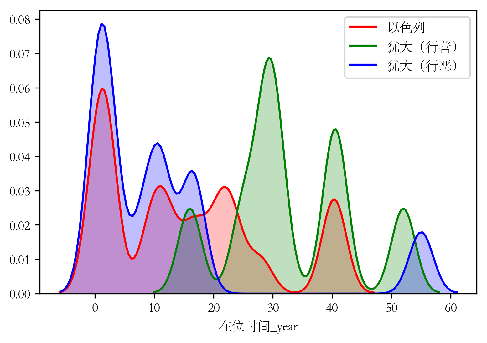

Samuel-Kings-Chronicles-notes
=======

## 以色列和犹大列王的统治时间
圣经中，上帝对大卫和所罗门的应许中，多次提到了要“坚定国位”、“子孙不断坐国位”（撒下 7:12-13, 16; 王上 9:5），但也要求“谨守律例”（王上 9:4）。那么，以色列和犹大列王的在位时间，与他们行善行恶是否有关系呢？

根据列王纪的记载，不计以色列统一时期的扫罗、大卫和所罗门，北国以色列诸王的平均统治时间为15.3年，南国犹大诸王的平均统治时间为20.4年，其中行善的王平均统治时间为32.9年，行恶的王平均统治时间为11.3年。其分布拟合结果如下图所示。

